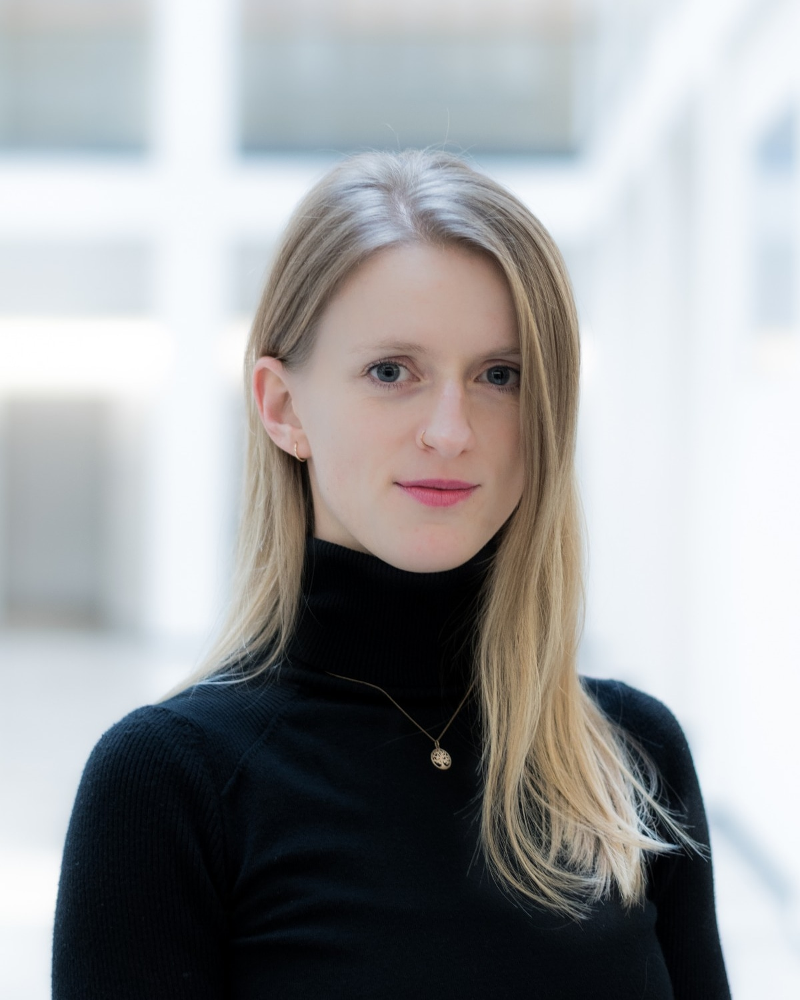

# Hello!

{align=left width=280}

I am a staff scientist at the Theoretical Cognitive Neuroscience Group (PI: Dominik Endres) at Philipps-Universität Marburg, Germany. In my research, I apply Bayesian graphical models to cognitive and perceptual decision-making, with a special interest in mental disorders such as autism, psychosis, and depression. I mostly use psychophysics and computational modelling, but currently playing with fMRI and EEG. 

I did my Ph.D. research at the Visual Perception Group (PI: Philipp Sterzer) at Charité Berlin, the Bernstein Center for Computational Neuroscience, and the Einstein Center for Neuroscience. My Ph.D. work was focussed on mechanisms of sensory information-processing in psychosis. 

My research interests: 

- [Psychosis](https://academic.oup.com/schizophreniabulletin/article/49/2/397/6849479)
- [Active Inference](https://osf.io/preprints/psyarxiv/8aexf)
- [Sensory processing](https://2023.ccneuro.org/view_paper.php?PaperNum=1185)
